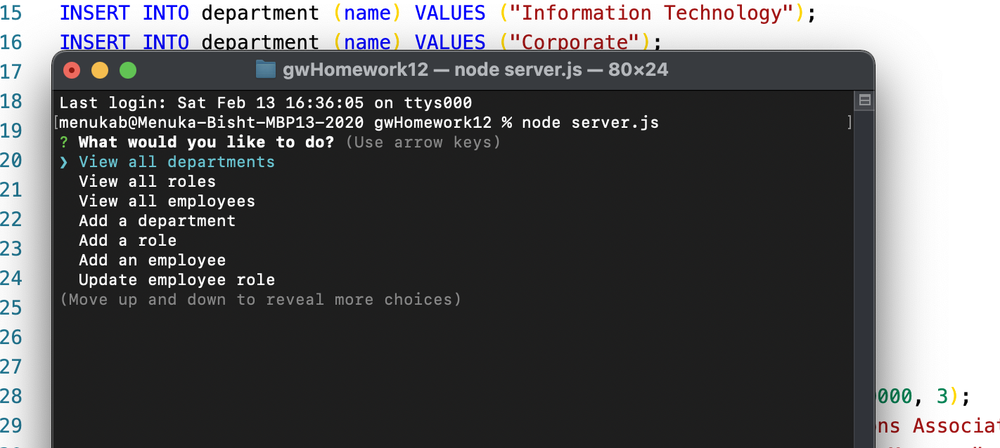
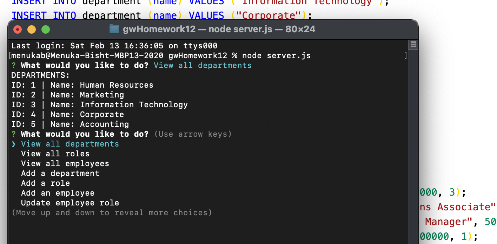

# Employee-Tracker 

This Application will allow Employer to be able to view and manage departments, roles and employees. You can use the following options with this application :
* View all employees with the option by role, department, or manager
* Add an employee, role, or department
* Update an employee, role, or department
* View department salary

## Github link 

### [github](https://github.com/Menuka786/gwHomework12)

### [Video link](https://drive.google.com/file/d/1oTF-Grzy-1g7VZ1nlOJfbhy36TsW41tC/view?usp=sharing)

## Installation

1. Run npm install to install all dependencies
2. Run schema.sql in MySQLWorkbench

## How to Use

1. Run node server.js to start the application in your terminal.

2. Follow prompts

## Tool & Resources
* Node.js - JavaScript runtime environment
* MySQLWorkbench - Visual database design tool

## Screen Shot

;
;

